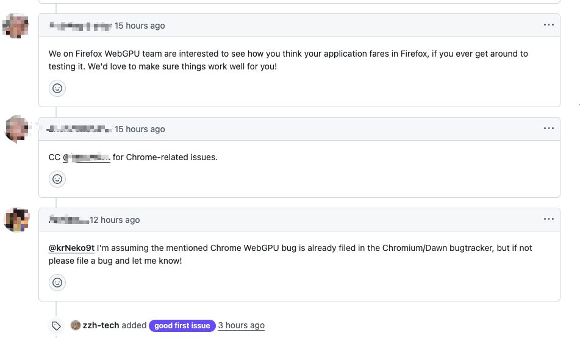
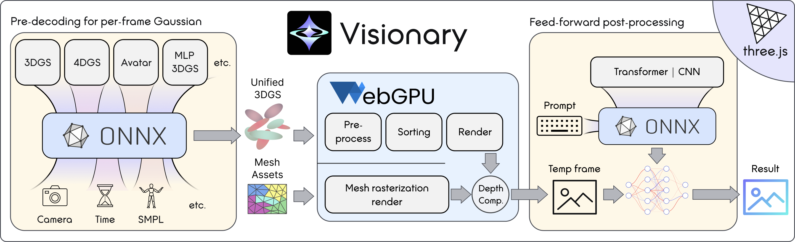
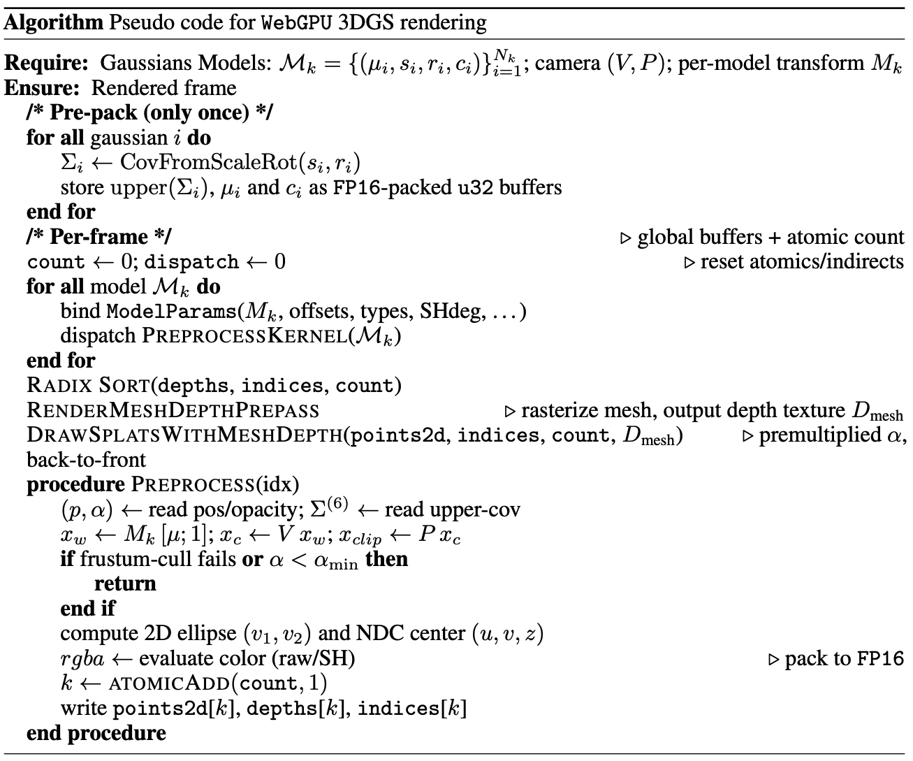
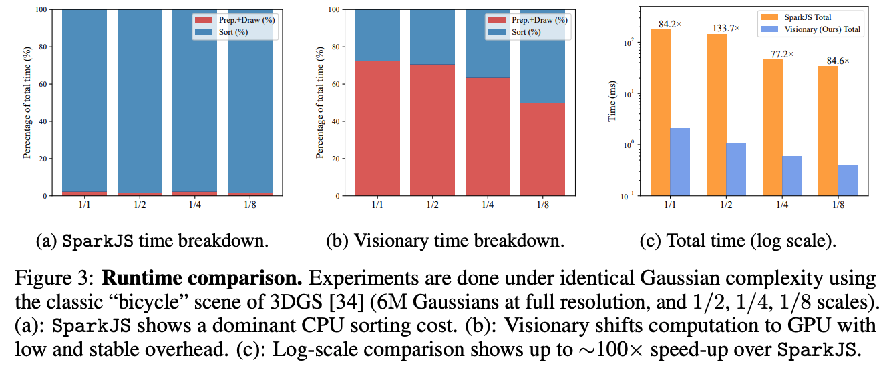
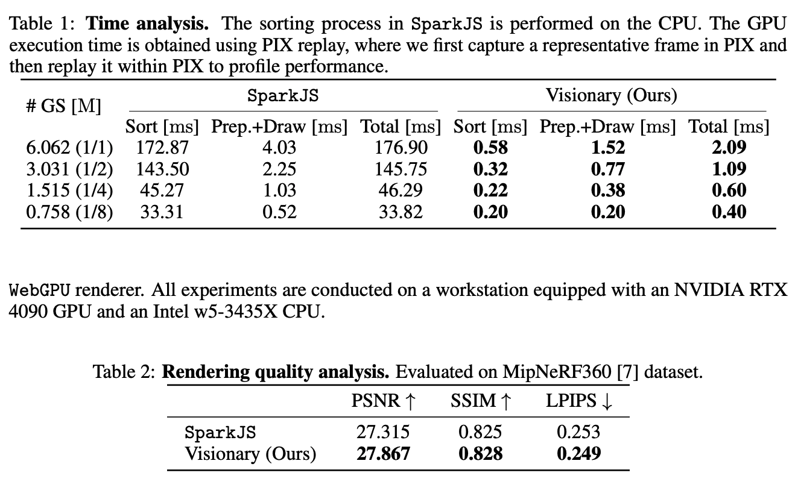
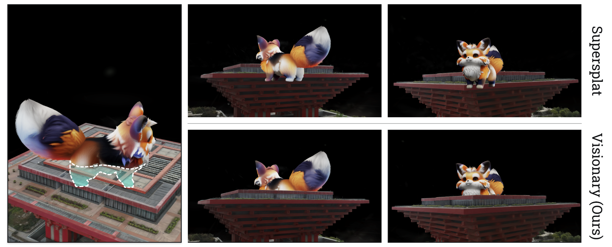
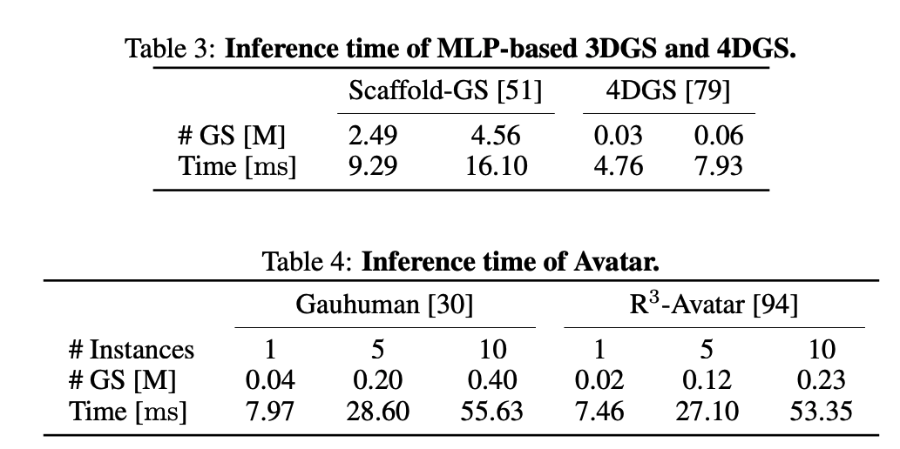

# Visionary | WebGPU-Powered Gaussian Splatting Platform（Technical Report）

**TL;DR**：Visionary 是一个 **web-native** 的 3DGS 渲染器，把「每帧高斯生成/更新」统一抽象成 **ONNX I/O Gaussian Generator contract**，并用 **WebGPU** 完成端到端的预处理、全局排序与渲染；同时支持把**生成式后处理**（如风格化/增强）也以 ONNX 的形式接到浏览器端流水线中。

---

##  Highlights

### 1) 国内“World Model 渲染基座”，愿景对标 WorldLabs
Visionary 的定位不仅是一个 3DGS viewer，而是面向 **World Model / Spatial Intelligence** 的 **渲染基座（rendering substrate）**：  
- 在浏览器端用 WebGPU 承载高吞吐 3D Gaussian 渲染与统一的数据通路  
- 以 ONNX Gaussian Generator contract把不同 3DGS/4DGS/Avatar/Scaffold/Custom Algorithm/后处理模型接入同一渲染器中  
- 让 world model 的“可视化与交互”从重型原生栈解耦为 **一条可分享链接即可运行** 的 web-native 形态  

### 2) 开源即获浏览器厂商关注：Firefox & Chrome 相关团队支持意向
项目开源后不久，我们收到了来自 **Firefox WebGPU** 与 **Chromium/Chrome WebGPU 相关方向**开发者的反馈：  
他们对 Visionary 在真实应用中的表现很感兴趣，并希望协助验证兼容性、推动相关支持（如下图）。

来自 Firefox/Chrome 相关人员的支持意向。

---

## 1. 项目动机与定位

现有 3DGS viewer 要么依赖沉重的原生栈（桌面端/引擎插件），要么受限于 WebGL 管线（很难支持动态 3DGS、Avatar、以及生成式模型接入），从而导致**部署难度大、扩展性差**。

Visionary 的目标是：用浏览器作为统一运行时，让用户“点开链接就能跑”，并且**同一套渲染器**可以承载不同 3DGS 变体（3DGS / MLP-based 3DGS / 4DGS / Avatar / Post-processing）。

---

## 2. 系统总览

### Figure 1：Web 编辑器与多资产统一渲染

Visionary 的 web 端编辑器示例（多种 3D/4D Gaussian + mesh 同时渲染）。

 

### Figure 2：整体流水线（Pre-decoding → Hybrid Render → Post-processing）

ONNX 预解码生成高斯 → WebGPU 混合渲染（含 mesh 深度合成）→ 可选 ONNX 生成式后处理。

---

## 3. 核心设计：Gaussian Generator Contract（ONNX I/O + Metadata）

### 3.1 为什么要 “Pre-decoding”
3DGS 变体很多：  
- **MLP-based 3DGS**：根据相机视角对 anchor 解码出每帧高斯；  
- **4DGS**：根据时间戳对 canonical 高斯做形变；  
- **Avatar**：根据 SMPL/pose 参数做骨骼前向运动学 + LBS 变形；  

如果渲染器为每个方法写一套 shader/分支，会迅速失控。Visionary 的做法是把“方法相关逻辑”全部封进 **ONNX 预解码**，渲染器只吃统一格式的高斯缓存。

### 3.2 Contract 的输入/输出（概念）
- **每帧输入**：轻量控制信号（frame index / time / camera / pose 等）
- **输出**：每帧高斯 `G_t`（packed layout：position / opacity / upper-cov / appearance），以及元信息（点数、dtype FP16/FP32 等）
- **渲染器侧**：直接把这些输出当作 WebGPU storage buffers 接进统一渲染管线

---

## 4. 工程优化：让 ORT-WebGPU 更稳更快

- **capture_graph 兼容**：保持 session/bindings 跨帧稳定（可 warm-up），降低 JS dispatch 开销、稳定帧时间  
- **Concat/Split 重写**：对导出后 ONNX 图里“大量 slot 一次性 concat/split”的结构做 chunk 化改写，规避 WebGPU 限制并保持相同 packed layout

---

## 5. 支持的代表性 3DGS 变体

### 5.1 MLP-based 3DGS（以 Scaffold-GS/Octree-GS 为例）
把训练好的 MLP + anchors（位置/尺度/特征）导出成静态 ONNX 图，使浏览器可在任意相机位姿下**在线解码每帧高斯参数**。

### 5.2 4DGS（以 4D Gaussians 为例）
把 deformation network（HexPlane 特征平面 + 轻量 MLP）封装成 ONNX；canonical 高斯作为 initializers 内嵌，运行时只输入时间戳 `t` 即可输出形变残差并完成渲染。

### 5.3 Animatable Avatar（以 GauHuman / LHM / R3Avatar 为例）
把 SMPL-X 骨骼 FK + LBS 等重计算封进 ONNX 图；客户端每帧只喂 pose/shape 或 frame index，ONNX 直接输出变形后的高斯（position/cov）交给渲染器。

---

## 6. WebGPU Hybrid Renderer（统一渲染管线）

渲染流程（概念）：
1. **Pre-pack（对于静态3DGS，一次性）**：把高斯属性转为 fp16，并进行 u32 打包以减少带宽  
2. **Per-frame preprocess（GPU compute）**：模型变换、视锥裁剪、2D ellipse 参数计算、写入全局 buffer + 深度 key  
3. **GPU 全局排序（radix sort）**：按深度完成 back-to-front 顺序  
4. **Mesh depth prepass**：若有 mesh，先光栅得到深度 `D_mesh`  
5. **Draw splats with depth-aware composition**：保留 depth test（不写 depth），实现正确遮挡与 alpha 合成

---

## 7. 实验与分析

### 7.1 Runtime & Scalability（vs. SparkJS）
<!-- 截图来源：PDF 第 9 页，Figure 3（三个子图：time breakdown + total time log-scale） -->

SparkJS 主要耗时在 CPU sorting；Visionary 把排序搬到 GPU，整体显著提速。

 

---

### 7.1 Time analysis and Rendering quality（MipNeRF360）（vs. SparkJS）

---

### 7.2 Robustness：快速转动视角时的稳定性（SparkJS lazy sorting 问题）

SparkJS 的 lazy sorting 在快速视角变化下会导致明显 temporal artifacts；Visionary 的 GPU 全局逐帧排序避免该问题。

---

### 7.3 Composition Correctness：为什么必须全局排序（vs. Supersplat local sorting）

局部排序在跨 partition 重叠时会产生不正确的透明度混合；Visionary 统一 global buffer + global sort 保证合成正确。

---

### 7.4 ONNX 预解码开销（动态/结构化变体可行性）
#### Table 2：MLP-based 3DGS / 4DGS inference / Avatar inference

---

## 8. 讨论与局限

Visionary 的定位更像一个“World Model Carrier”：既能承载重建式（显式 3D）表示，也能把生成式后处理/生成模型以 ONNX 的形式塞进浏览器侧闭环。

局限性主要来自：WebGPU 与 ONNX runtime 仍在快速演进，跨浏览器/系统存在兼容性差异；以及浏览器安全策略带来的 CPU 内存约束，导致部分较大的后处理网络仍可能需要离线执行。

---